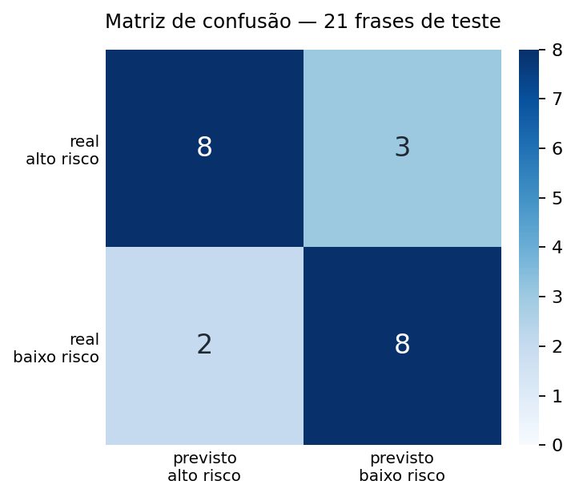

# CardioIA — Fase 2: Diagnóstico Automatizado

Módulo de apoio ao diagnóstico do projeto **CardioIA** (FIAP). Duas peças que resolvem
perguntas diferentes a partir do texto que o paciente escreve:

| Parte | Pergunta | Abordagem |
|---|---|---|
| **1 — Extração de sintomas** | *Qual doença esses sintomas sugerem?* | Mapa de conhecimento + regras, com evidência explícita |
| **2 — Classificador de risco** | *Com que urgência atender?* | TF-IDF + Regressão Logística (Scikit-learn) |

O vocabulário clínico e os quadros usados aqui seguem o
[UCI Heart Disease Data Set](https://archive.ics.uci.edu/dataset/45/heart+disease)
(Detrano et al., 1989), o mesmo dataset levantado pela equipe na
[Fase 1](https://github.com/davisjr2000/cardio-ia). Na análise de vieses, cruzamos o
classificador com os 303 pacientes daquela fase.

📹 **Vídeo de demonstração (4 min):** `<INSERIR LINK DO YOUTUBE — não listado>`

---

## Resultados medidos

**Parte 1 — extração e diagnóstico**

| Métrica | Valor |
|---|---|
| Relatos processados | 10 |
| Regras no mapa de conhecimento | 79, cobrindo 8 doenças |
| Acerto contra o gabarito interno | **10/10** |
| Menor margem para a 2ª hipótese | 4 pontos |
| **Relatos novos, mapa congelado** | **0/8** diagnósticos · 2/2 casos que deviam sair sem hipótese |

O mapa reconhece as frases que nós escrevemos, não os sintomas: "sem fôlego", "tornozelos
incham" e "rosto caído" ficam invisíveis. O sistema não chuta (sem evidência suficiente,
responde "sem hipótese"), mas sabe pouco fora da própria base.

**Parte 2 — classificação de risco**

| Avaliação | Acurácia | O que ela mede |
|---|---|---|
| Linha de base (`DummyClassifier`) | 0,476 | O piso: chutar sempre a classe mais comum |
| Árvore de decisão | 0,571 | |
| **Regressão logística — teste sorteado** | **0,762** | Consistência interna da base |
| Regressão logística — validação cruzada 5-fold | 0,829 ± 0,107 | Estabilidade (o desvio é grande: base pequena) |
| **Regressão logística — conjunto-desafio** | **0,375** | Frases novas, escritas para atacar fraquezas conhecidas |

> **As duas partes chegam ao mesmo resultado por caminhos diferentes:** 10/10 → 0/8 nas
> regras, 0,762 → 0,375 no classificador. A métrica medida na própria base mede a nossa
> escrita, não o problema. As análises estão na seção 8 do notebook da Parte 1 e na seção
> 6 do notebook da Parte 2.



Três dos onze casos de alto risco foram classificados como baixo risco. Numa triagem, é
o erro que custa caro — e o motivo de a métrica que governa este problema ser o **recall
de "alto risco"**, não a acurácia. Por isso ajustamos o limiar de decisão, escolhido pela
validação cruzada e não pelo teste:

| Limiar | Recall de alto risco | Graves perdidos (de 35) | Falsos positivos (de 35) | Acurácia |
|---|---|---|---|---|
| 0,50 (padrão) | 0,829 | 6 | 6 | 0,829 |
| **0,45** | **0,943** | **2** | 14 | 0,771 |
| 0,35 | 1,000 | 0 | 30 | 0,571 |

Com 0,45 a acurácia da validação cruzada cai e a triagem melhora: deixa de perder 4 casos graves em troca de 8
alertas a mais. Esses números vêm das mesmas probabilidades que escolheram o corte, então
são otimistas. Nas 21 frases do teste, o corte de 0,45 captura **11 de 11** casos graves
(eram 8) com 3 falsos positivos (eram 2). No conjunto-desafio, a medida independente, o
acerto vai de 3/8 para 4/8.

---

## Como rodar

```bash
python -m venv .venv && source .venv/bin/activate
pip install -r requirements.txt

python src/extracao.py           # Parte 1: processa os 10 relatos
python src/extracao.py --desafio # Parte 1: relatos novos, com o mapa congelado
python -m src.classificador      # Parte 2: treina, avalia, conjunto-desafio e limiar
python -m src.vieses_fase1       # vieses do dataset da Fase 1
python -m pytest                 # testes de regressão (negação, evidência mínima, limiar)

jupyter notebook notebooks/      # os dois notebooks, com toda a análise
```

Uma frase avulsa, sem editar arquivo:

```bash
python src/extracao.py --relato "sinto um aperto no peito quando faço esforço físico"
# -> Hipótese: Angina (pontuação 4, 1 regra(s) completa(s))
```

Os notebooks devem ser abertos a partir da pasta `notebooks/` (eles importam `src/` da
pasta acima). Testado com Python 3.12, pandas 2.2 e 3.0, scikit-learn 1.4 e 1.9: os
números são os mesmos.

---

## Estrutura

```
cardioia-fase2/
├── data/
│   ├── relatos_pacientes.txt        # Parte 1 — 10 relatos de sintomas
│   ├── mapa_conhecimento.csv        # Parte 1 — 79 regras (sintoma_1 | sintoma_2 | doenca_associada)
│   ├── relatos_desafio.csv          # Parte 1 — 10 relatos novos, escritos com o mapa congelado
│   ├── frases_risco.csv             # Parte 2 — 70 frases rotuladas (frase, situacao)
│   ├── frases_desafio.csv           # Parte 2 — 8 frases de estresse, fora do treino
│   ├── frases_ampliacao.csv         # Parte 2 — 8 frases do experimento de correção da base
│   └── pacientes_cardiacos_fase1.csv # dataset da Fase 1 (UCI Cleveland, 303 pacientes)
├── src/
│   ├── extracao.py                  # normalização, negação, extração e ranqueamento
│   ├── classificador.py             # pipeline TF-IDF + modelo, avaliação, limiar, previsão
│   └── vieses_fase1.py              # prevalência por tipo de dor e sexo no dataset da Fase 1
├── tests/                           # testes de regressão
├── notebooks/
│   ├── parte1_extracao_sintomas.ipynb
│   └── parte2_classificador_risco.ipynb
├── docs/matriz_confusao.png
└── requirements.txt
```

Os notebooks **importam** `src/` em vez de repetir o código: a mesma lógica roda na
análise e na linha de comando, sem duas versões para manter em sincronia.

---

## Decisões técnicas

**Sem evidência suficiente, sem diagnóstico.** A Parte 1 só sugere uma doença se pelo
menos uma regra do mapa disparou inteira (as duas expressões). "Dor no peito" sozinha
está em três doenças com o mesmo peso; escolher entre elas seria decidir pelo desempate.
Na embolia pulmonar do desafio, foi essa regra que evitou a resposta "Arritmia cardíaca".

**O ranqueamento não soma linhas do mapa.** A pontuação de uma doença é
`nº de expressões distintas encontradas + 2 × nº de regras que dispararam inteiras`.
Somar linha a linha faria "dor no peito" — presente em 7 regras de infarto — vencer por
repetição, sem nenhuma evidência específica. Contar expressões distintas elimina isso; o
bônus premia a evidência combinada, que é o que o mapa de fato codifica.

**A extração trata negação; o classificador não.** `"não sinto dor no peito"` é
descartada corretamente pela Parte 1 e classificada como **alto risco com 75% de
confiança** pela Parte 2 — para o TF-IDF, "não" é só mais um token. As duas abordagens
falham em lugares diferentes, e nenhuma domina a outra.

**Divergimos de um exemplo do enunciado.** Ele sugere `"falta de ar" → Angina`.
Clinicamente, dispneia isolada é sinal de **insuficiência cardíaca**; angina se define
pela dor torácica desencadeada por esforço. Seguimos a classificação clínica e
registramos a divergência.

**Frases de baixo risco também falam em peito.** Se só as frases graves mencionassem
"peito" ou "dor", o classificador acertaria tudo procurando uma palavra, e a avaliação
não mediria nada. A sobreposição de vocabulário entre as classes é intencional.

**Corrigimos a base, não o modelo — e a acurácia caiu.** Adicionar 8 frases de negação e
apresentação atípica levou a validação cruzada de 0,829 para 0,745 e o conjunto-desafio de
3/8 para 4/8. O ganho é de uma frase só, na margem (0,48 → 0,54). E a negação **não foi
aprendida** mesmo com 4 exemplos novos: num saco de palavras, "não" não se liga ao termo
seguinte. É o erro que a regra da Parte 1 resolve, e o melhor argumento para combinar as
duas abordagens.

---

## Vieses conhecidos

| Viés | Origem | Efeito medido |
|---|---|---|
| Apresentação atípica sub-representada | As frases seguem o padrão clássico "dor no peito com irradiação" | Infarto atípico (mais frequente em mulheres) classificado como **baixo risco** |
| Vocabulário como proxy de gravidade | "leve", "pouco" só aparecem em frases de baixo risco | Quem minimiza a própria queixa é despriorizado |
| Base autoral | As 70 frases foram escritas e rotuladas pela mesma equipe | O modelo aprende o nosso jeito de escrever, não o do paciente |
| Ausência de negação no treino | Nenhuma frase original diz "não sinto" | Consulta de rotina vira urgência |

### O dataset da Fase 1 contra o classificador

Cruzamos o classificador com os 303 pacientes do UCI Cleveland levantados na Fase 1, que
têm diagnóstico confirmado por angiografia e o tipo de dor torácica relatado:

| Dado medido | Valor |
|---|---|
| Doentes **sem dor no peito** ("assintomático") | **105 de 139 (75,5%)** |
| Mulheres doentes sem dor no peito | **22 de 25 (88%)** |
| % de doentes entre quem relatou angina típica | 30,4% |
| % de doentes entre os "assintomáticos" | 72,9% |

O classificador aprendeu que "peito" puxa para alto risco. No dado real da Fase 1, **o
doente mais comum é o que não fala em peito**: a apresentação atípica que erramos no
desafio é o paciente típico, não um caso de borda. Ressalvas: são pacientes encaminhados
para cateterismo (não a população geral), com só 25 mulheres doentes e coleta de 1988
nos EUA. **Quem escreve os dados decide o que o modelo enxerga**, e isso não se corrige
trocando de algoritmo.

Fonte: Detrano R. et al., *Heart Disease*, UCI Machine Learning Repository, 1989,
DOI [10.24432/C52P4X](https://doi.org/10.24432/C52P4X), licença CC BY 4.0. O CSV é o
mesmo do repositório da Fase 1, com as colunas já traduzidas pela equipe.

---

## Limites de uso

Exercício acadêmico sobre **frases fictícias escritas por nós**. Nenhum relato é de
paciente real. O sistema não foi validado clinicamente, erra casos graves de forma
sistemática e documentada, e **não é dispositivo médico**: não deve orientar decisão
sobre pessoa nenhuma.

---

## Equipe

| Nome | RM |
|---|---|
| Guilherme Paes Barreto Didier Garcia | RM568457 |
| Davis Roberto | RM567941 |
| Guilherme Chan | RM567722 |
| Deivid Paula da Silva Oliveira | RM566752 |

FIAP — Inteligência Artificial · Projeto CardioIA · Fase 2
